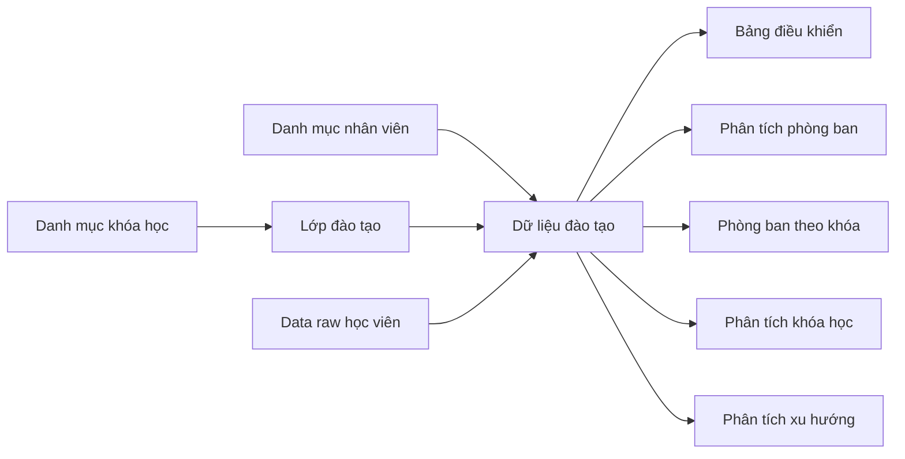

# SYSTEM SUMMARY

## 1. Tóm tắt nhanh
Hệ thống hiện tại là một workbook Google Sheets được nâng cấp theo hướng ứng dụng vận hành dữ liệu L&D.

Dữ liệu đi qua 4 tầng:
1. `Danh mục`
2. `Lớp đào tạo`
3. `Data raw học viên`
4. `Dữ liệu đào tạo + Analytics`

Current version của hệ thống: `v3.2.8`

## 2. Bảng tổng hợp sheet
| Sheet | Vai trò | Có nhập tay không | Loại sheet |
|---|---|---|---|
| `Bắt đầu` | onboarding | Không | hướng dẫn |
| `Hướng dẫn nhập liệu` | bảng tổng hợp cột bắt buộc / khuyến nghị | Không | hướng dẫn |
| `Danh mục nhân viên` | master nhân sự | Có | input |
| `Danh mục khóa học` | master khóa học | Có | input |
| `Lớp đào tạo` | thông tin từng lớp / session | Có | input |
| `Data raw học viên` | danh sách học viên theo lớp | Có, chủ yếu paste | input |
| `Dữ liệu đào tạo` | fact table đã resolve | Không nên nhập tay | system-managed |
| `Bảng điều khiển` | KPI tổng hợp | Không | output |
| `Điều hành hệ thống` | trạng thái vận hành | Không | output |
| `Phân tích phòng ban` | coverage theo phòng | Không | output |
| `Phòng ban theo khóa` | phòng x khóa | Không | output |
| `Phân tích khóa học` | hiệu quả theo khóa | Không | output |
| `Phân tích xu hướng` | theo tháng / thời gian | Không | output |
| `Staging nhân sự` | staging import | Không nên nhập tay | technical |
| `Staging khóa học` | staging import | Không nên nhập tay | technical |
| `Staging đào tạo` | staging import | Không nên nhập tay | technical |
| `Kết quả QA` | lỗi / cảnh báo QA | Không | technical |
| `Hàng đợi xử lý` | queue jobs | Không | technical |
| `Nhật ký tác động` | audit log | Không | technical |
| `Nhật ký lỗi` | error log | Không | technical |
| `Snapshot báo cáo` | snapshot định kỳ | Không | technical |
| `Cấu hình hệ thống` | config runtime | Không nên nhập tay | technical |
| `Phân quyền người dùng` | user roles | Có kiểm soát | technical |

## 3. Bảng tổng hợp menu
| Menu | Mục đích |
|---|---|
| `Khởi tạo hệ thống` | bootstrap workbook |
| `Mở Trang bắt đầu` | onboarding |
| `Mở Thông tin bàn giao` | mở sidebar bàn giao |
| `Mở Hướng dẫn nhập liệu` | mở sheet hướng dẫn |
| `Nạp dữ liệu demo` | sinh 5 khóa học, 5 lớp và 25 raw demo |
| `Nhập liệu nhanh` | nhập lẻ 1 học viên |
| `Lớp đào tạo nhanh` | tạo nhanh 1 lớp đào tạo |
| `Trung tâm import` | import file staging |
| `Kiểm tra dữ liệu` | QA |
| `Publish dữ liệu` | publish staging |
| `Làm mới báo cáo` | sync raw + rebuild analytics |
| `Sao lưu` | tạo backup workbook |
| `Tạo archive năm` | archive dữ liệu năm |
| `Khôi phục` | restore từ backup |
| `Thông tin hệ thống` | xem trạng thái runtime |
| `Chạy test nhanh` | smoke test |

## 4. Luồng dữ liệu chính

## 5. Quy tắc vận hành thực tế
- `Danh mục nhân viên` phải đủ mạnh để map `Mã nhân viên -> Phòng ban`
- `Danh mục khóa học` có thể thiếu một số trường phụ, nhưng tối thiểu phải xác định được khóa học
- `Lớp đào tạo` là nơi ghi nhận từng đợt đào tạo thực tế
- `Data raw học viên` là nơi paste hàng loạt người học
- `Làm mới báo cáo` sẽ đồng bộ `Data raw học viên -> Dữ liệu đào tạo`
- Dashboard và analytics không phải nơi nhập tay

## 6. Bảng tổng hợp module mã nguồn
| Module | Vai trò |
|---|---|
| `Constants.gs` | config trung tâm |
| `Repository.gs` | truy cập sheet, bootstrap schema, soft-migrate output |
| `SecurityService.gs` | RBAC, lock |
| `GuideService.gs` | bảng hướng dẫn nhập liệu |
| `SheetUxService.gs` | dropdown, checkbox, conditional formatting |
| `EmployeeService.gs` | employee master |
| `CourseCatalogService.gs` | course master |
| `TrainingSessionService.gs` | lớp đào tạo, data raw, sync raw |
| `TrainingRecordService.gs` | fact training records |
| `ValidationService.gs` | QA / validation |
| `ImportService.gs` | import file |
| `AnalyticsService.gs` | dashboard + report |
| `BackupService.gs` | backup |
| `ArchiveService.gs` | archive năm |
| `AppController.gs` | public entrypoints |
| `MenuService.gs` | menu UI |

## 7. Trạng thái hiện tại
- Version đang dùng: `v3.2.8`
- RBAC: `tạm tắt để test`
- `Hướng dẫn nhập liệu`: đã có
- `Lớp đào tạo nhanh`: đã có
- Demo dataset: đã có `loadDemoDataset()` và `clearDemoDataset()`
- Dashboard / analytics: đã có `soft-migrate schema`
- Test nhanh: đã tự self-heal schema cho output sheets
