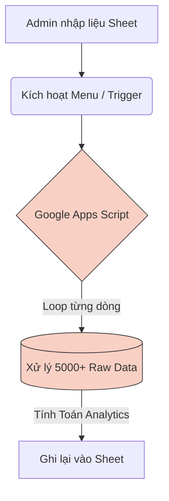
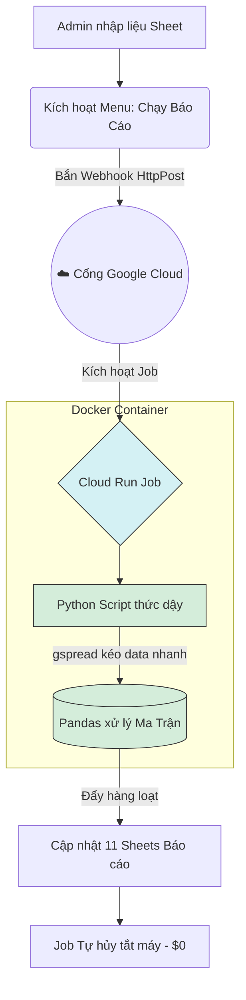

# 🚀 HR-NEXUS: TÀI LIỆU BÀN GIAO & LỘ TRÌNH KIẾN TRÚC V4.0
Ngày cập nhật: 10/04/2026
Phiên bản hiện tại: v3.5.1 (Bản lề chuyển giao)

---

## 1. TỔNG QUAN HỆ THỐNG
**Hệ thống Báo Cáo Đào Tạo (HR-NEXUS)** là nền tảng quản lý dữ liệu L&D của doanh nghiệp, giúp biến đổi dữ liệu thô từ báo cáo thành các Dashboard phân tích (Analytics) tự động.

Hệ thống đang ở giai đoạn "đụng trần" của công nghệ cũ (v3.5) và chuẩn bị được tái cấu trúc triệt để sang nền tảng điện toán đám mây (v4.0) để giải quyết các giới hạn về hiệu năng khi quy mô dữ liệu vượt 5,000 dòng.

---

## 2. NGÔN NGỮ & TECH STACK

### 2.1. Hiện tại (Legacy - v3.5)
- **Database / UI:** Google Sheets.
- **Backend / Logic:** Google Apps Script (ES6 JavaScript).
- **Automation:** Time-driven triggers (Cron) của GAS.
- **Kiến trúc:** Clean Architecture (nhưng bị giới hạn bởi resource của GAS).

### 2.2. Tương lai (Modern Cloud - v4.0)
- **Database / UI:** VẪN GIỮ Google Sheets (Không thay đổi thói quen người dùng).
- **Trigger Layer:** Google Apps Script (Chỉ đóng vai trò nút bấm và gửi tín hiệu).
- **Data Engine (Core):** Python 3.10+ (Thư viện: `pandas`, `gspread`).
- **Cloud Infrastructure:**
  - **Google Cloud Run Jobs:** Chạy script Python dưới dạng Run-to-completion.
  - **Docker:** Đóng gói môi trường Python.
  - **Google Cloud IAM & Service Accounts:** Quản lý quyền truy cập bảo mật.

---

## 3. MÔ HÌNH HIỆN TẠI VS MÔ HÌNH TƯƠNG LAI

### 3.1. Mô hình Hiện tại (Bottleneck)

> [!WARNING]
> Điểm nghẽn: Timeout 6 phút, API rate limit. Gần đây nhất là lỗi auto-append ở Cấu hình hệ thống sinh ra ~12,692 dòng rác khiến hệ thống tê liệt. Lỗi đã được fix ở v3.5.1.

### 3.2. Mô hình Tương lai (Đám mây - Cloud Run Jobs)

> [!TIP]
> Tách biệt UI (Sheet) và Backend (Python). Chạy bao lâu tùy thích (max 24h), tự mở server bật container cấu hình mạnh xử lý tính toán trong tích tắc rồi tự tắt.

---

## 4. WORKFLOW: KẾ HOẠCH NÂNG CẤP LÊN V4.0 (ROADMAP)

Lộ trình chuyển đổi được chia làm 3 Phase. Chạy song song kiến trúc mới với kiến trúc cũ để đảm bảo an toàn.

### PHASE 1: POC (Proof of Concept) - Local Python
- **Mục tiêu:** Chứng minh Python/Pandas có thể sinh báo cáo thay cho GAS.
- **Công việc:**
  - Viết code Python chạy local trên máy tính.
  - Dùng `pandas` để tái thiết toàn bộ logic của `AnalyticsService.gs`.
  - Thiết lập `credentials.json` (Service Account) phân quyền.

### PHASE 2: Cloudization (Lên Mây)
- **Mục tiêu:** Đóng gói code lên Google Cloud Run Jobs.
- **Công việc:**
  - Viết `Dockerfile` (Chứa Python, install pandas, gspread).
  - Deploy job thông qua lệnh: `gcloud run jobs deploy`.
  - Giữ bảo mật credentials bằng **Google Secret Manager**.

### PHASE 3: Integration & Handover (Tích hợp & Cắt cầu cũ)
- **Mục tiêu:** Thay thế hoàn toàn GAS cũ cho Logic Tính toán nặng.
- **Công việc:**
  - Sửa Menu trên Google Sheet: Nút bấm chỉ lấy JWT Token và bắn lệnh `UrlFetchApp` lên Cloud Run API.
  - Gắn email notification sau khi Job hoàn tất.
  - Chạy QC Automation Suite.

---

## 5. TÀI LIỆU BÀN GIAO (HANDOVER)

### 5.1. Dành cho Quản trị viên (Admin)
- Tính năng Automation của Sheets hiện đang hoạt động bình thường, an toàn với ngắt quãng (Resume Checkpoints).
- Nếu "Cấu hình hệ thống" bị phình to bất thường, click menu: **HR-NEXUS > Quản trị > 🧹 Dọn sạch cấu hình hệ thống**.
- Hãy theo dõi `Nhật ký lỗi` trong Spreadsheet nếu bảng báo cáo bị kẹt ở trạng thái PROCESSING quá 5 phút.

### 5.2. Dành cho Backend Developer / AI Agent
**Sự Mệnh & Context Khởi tạo:**
> "Hệ thống HR-NEXUS hiện tại dùng Google Sheets làm Database. Nhiệm vụ sắp tới của bạn là hiện thực hóa kiến trúc Cloud Run Jobs. Cần viết một script Python (Pandas) để đọc data từ Sheets, thực hiện các pipeline tính toán số liệu L&D, và ghi đè cục bộ ngược lại Sheets. Code cần được Dockerize và sẵn sàng cho Cloud Run."

**File cần đọc để tái tạo Business Logic:**
- `AnalyticsService.gs` (nơi chứa mọi công thức chuyển từ dòng sự kiện thành báo cáo).
- `RawDataService.gs` (logic incremental sync).
